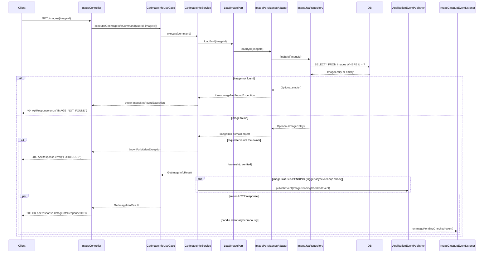
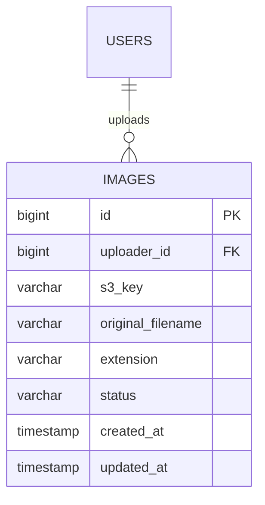

<!-- GENERATED FROM .claude/skills/design-skill/SKILL.md by scripts/agents/sync-skills.py.
     DO NOT EDIT DIRECTLY — edit the source SKILL.md and re-run the script. -->

# Feature Design Document Skill (MZTK-BE)

## Purpose

When a user requests a feature design, generate a comprehensive design document following the
project's format template. The document serves as a blueprint shared on the team Notion page.
All design decisions must be grounded in Hexagonal Architecture and GRASP patterns as used in
this project.

## Workflow

### Step 1 — Clarify the Feature Scope

Before exploring the codebase, ask (or infer from context) the following:

1. What is the feature's purpose and target user?
2. Which existing modules does it touch? (e.g. `user`, `auth`, `image`, `community`)
3. Does it require new DB tables or modifications to existing ones?
4. Are there any known constraints (performance, security, consistency)?

If the user provided a Jira ticket or description, extract answers from it directly.

### Step 2 — Explore the Codebase

Use Glob and Read to understand the current state of relevant modules before writing anything.
Focus on:

- Existing port interfaces (`application/port/in/`, `application/port/out/`) for the affected modules
- Existing JPA entities and repositories (`infrastructure/persistence/`)
- Existing domain models (`domain/model/`, `domain/vo/`)
- Related Flyway migrations (`src/main/resources/db/migration/`)
- Any event listeners or schedulers that might be affected

This exploration is mandatory — do not generate design artifacts based on assumptions alone.

### Step 3 — Generate the Design Document

Produce a single Markdown file following the exact structure in the template below.
Save it as `docs/design/<feature-name>/<feature-name>.md` (create the `docs/design/<feature-name>` directory if it doesn't exist),
or output it directly in the conversation if the user prefers.

---

## Document Template

Follow the structure from `.claude/skills/design-skill/design-format.md` exactly.
The sections and their rules are described below.

---

### Section 0 — API Endpoint

List every REST endpoint introduced or modified by this feature.

Format:

```
# 0. API Endpoint

## 1. <Feature Name> (e.g. "이미지 정보 조회")

| Method | Path | Auth | Description |
|--------|------|------|-------------|
| GET | /images/{imageId} | JWT | 이미지 메타데이터 조회 |
```

Include request body schema (JSON) and response schema (JSON) for each endpoint.

---

### Section 1 — 패키지 설계 (Package Design)

Show a full directory tree of **only** the files that need to be created or modified.
Use `(new)` and `(modify)` annotations.

Rules:
- Follow the hexagonal layout: `api/`, `application/port/in|out/`, `application/service/`, `application/dto/`, `domain/model|vo/`, `infrastructure/persistence/`, `infrastructure/event/`, `infrastructure/scheduler/`, `infrastructure/config/`
- Include Flyway migration files under `src/main/resources/db/migration/`
- Never include files that are unchanged
- Group by module (e.g. `modules/image/`, `modules/community/`)

Example:

```
modules/
└── image/
    ├── api/
    │   ├── controller/
    │   │   └── ImageController.java (new)
    │   └── dto/
    │       └── ImageInfoResponseDTO.java (new)
    ├── application/
    │   ├── port/
    │   │   ├── in/
    │   │   │   └── GetImageInfoUseCase.java (new)
    │   │   └── out/
    │   │       └── LoadImagePort.java (new)
    │   ├── service/
    │   │   └── GetImageInfoService.java (new)
    │   └── dto/
    │       └── GetImageInfoResult.java (new)
    ├── domain/
    │   └── model/
    │       └── ImageInfo.java (new)
    └── infrastructure/
        └── persistence/
            ├── adapter/
            │   └── ImagePersistenceAdapter.java (new)
            ├── entity/
            │   └── ImageEntity.java (new)
            └── repository/
                └── ImageJpaRepository.java (new)
src/main/resources/db/migration/
└── V{next}.sql (new)
```

---

### Section 2 — 시퀀스 다이어그램 (Sequence Diagram)

Write one Mermaid `sequenceDiagram` per use case. Cover **every** use case introduced by the feature.

Rules for diagram detail:
- Participants must correspond to actual classes/interfaces from Section 1's package design
- Show every layer: Controller → UseCase (port) → Service → OutputPort → PersistenceAdapter → JpaRepository → DB
- Include domain model creation (`Image.create(...)`) and validation steps
- Include event publishing (`ApplicationEventPublisher.publishEvent(...)`) when applicable
- Label each arrow with the actual method name and key parameters
- **Never use bare `Note over X: throw XxxException` for error paths — always use `alt`/`opt` blocks instead**

#### Control Flow Patterns (mandatory)

Use the appropriate Mermaid control flow construct for every branching, conditional, or concurrent path.
Do **not** collapse multiple outcomes into a single straight-line diagram.

| Construct | When to use | Example trigger |
|-----------|-------------|-----------------|
| `alt … else … end` | Mutually exclusive branches (if/else) | resource not found, ownership check fails, validation error |
| `opt … end` | Optional step that may or may not execute | cache hit shortcut, event publishing only on state change |
| `loop … end` | Repeated execution (retry, batch, pagination) | scheduler batch loop, S3 upload retry |
| `par … and … end` | Concurrent / parallel flows | async event + sync response, multi-service fan-out |

Rules for applying these constructs:

1. **`alt` for every error response** — each HTTP 4xx/5xx path must be its own `else` branch inside an `alt` block. Never hide error cases in a prose note.
2. **One `alt` per decision point** — if a service method can fail for multiple independent reasons, nest `alt` blocks or add additional `else` clauses rather than skipping them.
3. **`opt` for side effects** — use `opt` when a step (e.g. cache update, event publish) only happens under a specific condition that doesn't change the main response.
4. **`loop` for schedulers and retries** — wrap the repeated segment; label the loop with its exit condition (e.g. `loop until batchSize == 0`).
5. **`par` for async flows** — when an event listener or async task runs concurrently with the HTTP response, show them in a `par … and …` block.

Example (demonstrates `alt`, `opt`, and `par`):



---

### Section 3 — 데이터 모델 (Data Model)

#### 3-1. ERD (Mermaid)

Draw an `erDiagram` showing only the tables introduced or modified by this feature.
Include column names, types, and cardinality relationships.



#### 3-2. DB 테이블 정의 (SQL DDL)

Write production-ready PostgreSQL DDL for every table that is created or altered.

Rules:
- Use `BIGSERIAL` for surrogate PKs
- Use `TIMESTAMPTZ` for timestamps
- Add `NOT NULL` constraints where appropriate
- Include index definitions (partial indexes for status columns are preferred)
- For `ALTER TABLE` changes, include the exact statement

```sql
CREATE TABLE images (
    id          BIGSERIAL PRIMARY KEY,
    uploader_id BIGINT NOT NULL REFERENCES users(id),
    s3_key      VARCHAR(512) NOT NULL,
    ...
    created_at  TIMESTAMPTZ NOT NULL DEFAULT now(),
    updated_at  TIMESTAMPTZ NOT NULL DEFAULT now()
);

CREATE INDEX idx_images_uploader_id ON images(uploader_id);
```

---

### Section 4 — 보안 고려사항 (Security Considerations)

Use a Markdown table. Include only considerations that are non-trivial and specific to this feature.

| 항목 | 설명 |
|------|------|
| 접근 제어 | 본인 소유 리소스인지 검증 (service layer에서 domain 메서드로 확인) |
| S3 Pre-signed URL | URL 만료 시간 제한, 직접 객체 URL 노출 금지 |
| 파일 확장자 검증 | `AllowedImageExtension` enum 화이트리스트 기반 검증 |

---

### Section 5 — 구현 시 유의사항 (Implementation Notes)

Explain key architectural and concurrency decisions. Do not list obvious or trivial points.
Each item must include the *why* behind the decision.

Topics to cover (only if relevant to this feature):

- **트랜잭션 경계**: which operations are in the same transaction vs. split with `REQUIRES_NEW` or `@TransactionalEventListener(phase = AFTER_COMMIT)`
- **동기/비동기 처리**: justify sync vs. async (e.g. S3 upload is async via pre-signed URL; token distribution is event-driven after commit)
- **DB Lock 경쟁**: if multiple services write to the same row (e.g. XP accumulation), specify `SELECT FOR UPDATE` / optimistic lock strategy
- **Eventual consistency**: if an event-driven flow can miss events, describe the scheduler fallback
- **Cascade & orphan removal**: if parent-child JPA relationships are introduced, specify cascade strategy
- **멱등성**: for operations triggered by external events (webhooks, retries), describe idempotency key strategy

---

## Design Principles Reminder

Every design decision should be traceable to one of these:

**Hexagonal Architecture:**
- Application services depend only on port interfaces — never on infrastructure directly
- Infrastructure adapters implement ports and are wired by Spring DI
- Domain models contain business rules; JPA entities contain persistence mappings only
- `@ConfigurationProperties` classes in `infrastructure/config/` can implement policy ports

**GRASP Patterns:**
- **Information Expert**: assign responsibility to the class that has the data (domain validates its own rules)
- **Creator**: the class that aggregates or records another is responsible for creating it
- **Controller**: `{Verb}{Feature}Service` orchestrates the use case; the controller only translates DTOs
- **Low Coupling / High Cohesion**: split use cases into fine-grained ports rather than fat repositories
- **Pure Fabrication**: use dedicated service classes (e.g. `AuthTokenIssuer`) for cross-cutting concerns that don't belong to a domain entity

---

## Output Quality Checklist

Before finalising the document, verify:

- [ ] Every class in the sequence diagram appears in the package tree
- [ ] Every new table in the ERD has a corresponding DDL block
- [ ] Every use case has its own sequence diagram
- [ ] Every error / exception path is expressed with an `alt` block, not a bare `Note over`
- [ ] Optional side effects (cache, event publish) use `opt` blocks
- [ ] Repeated / batch operations use `loop` blocks with an explicit exit condition
- [ ] Concurrent flows (async event + HTTP response) use `par` blocks
- [ ] Security items are feature-specific, not generic boilerplate
- [ ] Implementation notes explain *why*, not just *what*
- [ ] Package tree uses `(new)` / `(modify)` annotations consistently
- [ ] Migration file is included if any table is created or altered
- [ ] Flyway version number is the next available (check `src/main/resources/db/migration/`)
