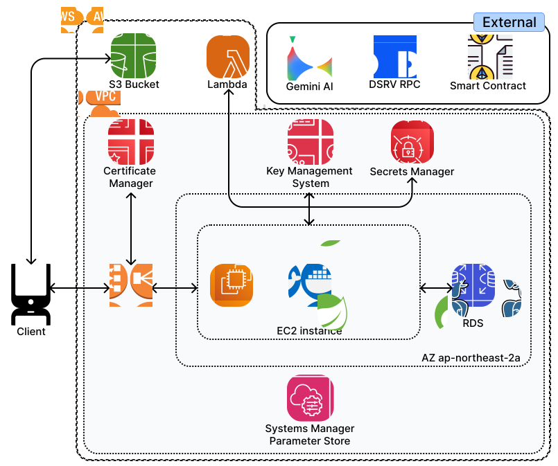
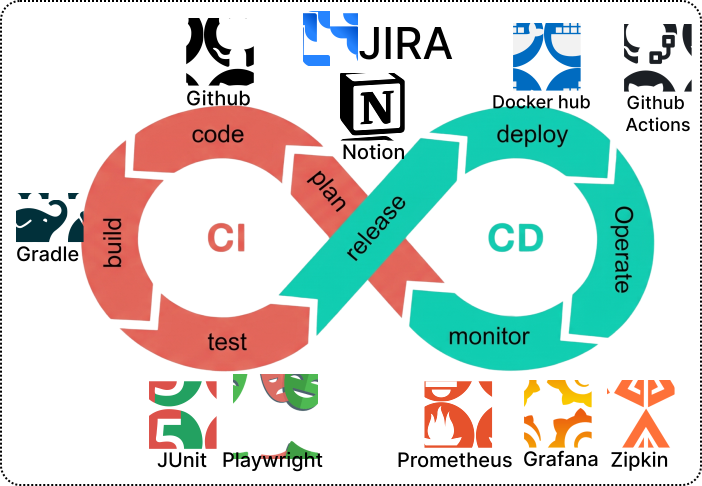
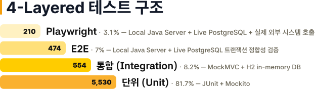
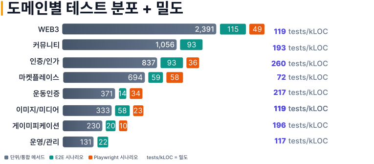

# MZTK-BE

<p align="left">
  
</p>

<h3>몸짱토큰 백엔드 서버</h3>

<p>
  운동 인증, XP/레벨 정책, 커뮤니티, 마켓플레이스, Web3 토큰 실행을 하나의 상태 흐름으로 연결하는 Spring Boot API 서버입니다.
</p>

<p align="left">
  
  
  
  
  
</p>

<p align="left">
  <a href="https://github.com/Momzzang-Seven">Overview</a>
  ·
  <a href="https://github.com/Momzzang-Seven/MZTK-FE">Frontend</a>
  ·
  <a href="https://github.com/Momzzang-Seven/MZTK-BLOCKCHAIN">Blockchain</a>
  ·
  <a href="./DEV.md">Developer Guide</a>
</p>

## Backend Overview

**몸짱토큰**은 운동 인증을 XP와 레벨로 환산하고, 레벨업 보상을 ERC-20 토큰으로 지급하는 Web3 피트니스 플랫폼입니다. MZTK-BE는 이 과정에서 사용자의 앱 활동을 서버의 도메인 상태, 외부 저장소, AI 검증, Web3 트랜잭션 상태와 일관되게 연결합니다.

이 백엔드는 단순 CRUD API보다 **상태 전이와 외부 시스템 동기화**에 초점을 둡니다. 운동 인증은 XP ledger로 이어지고, XP는 레벨업과 보상 intent를 만들며, Q&A와 마켓플레이스는 on-chain escrow 상태와 서버 예약/채택 상태를 함께 관리합니다.

## Backend Responsibilities

| Area | What Backend Owns |
|---|---|
| API Boundary | 모바일 앱의 인증, 조회, 생성, 복구, 운영 API 제공 |
| Domain State | 계정, 운동 인증, XP, 레벨, 게시글, 답변, 예약, Web3 실행 상태 관리 |
| Consistency | DB transaction과 S3/KMS/Lambda/RPC side effect의 순서와 복구 정책 관리 |
| Web3 Orchestration | EIP-712 서명, EIP-7702 sponsor 실행, escrow, receipt polling, retry/recovery |
| Operations | 관리자 검토, 수동 성공/환불/재처리, audit log, monitoring surface 제공 |
| Quality | 테스트 계층, migration 검증, 부하 테스트, CI/CD, 보안 스캔 관리 |

## Framework & Runtime Stack

MZTK-BE는 Spring Boot를 애플리케이션 실행 기반으로 사용하지만, 비즈니스 규칙은 framework에 직접 묶이지 않도록 모듈 내부를 Hexagonal Architecture로 나눕니다. Controller, JPA, AWS SDK, Web3j 같은 기술은 도메인 바깥의 adapter 역할을 맡고, 핵심 정책은 application service와 domain model에서 다룹니다.

| Layer | Framework / Library | Backend Usage |
|---|---|---|
| Runtime | Java 21, Spring Boot 3.4, Gradle | 실행 환경, 의존성 관리, profile/configuration, build task 구성 |
| Web API | Spring MVC, Validation | REST API, request 검증, controller와 use case 경계 관리 |
| Security | Spring Security, JWT, OAuth2 | 인증/인가, role policy, refresh token, OAuth2 login 흐름 |
| Persistence | Spring Data JPA, QueryDSL, Flyway | aggregate 저장, 동적 조회, schema migration, entity drift 관리 |
| External Adapter | AWS SDK, Web3j, Gemini/Lambda 연동 | S3/KMS/Secrets, Web3 RPC, AI verification callback을 port 뒤에서 처리 |

## System Architecture

<p align="center">
  
</p>

Backend는 HTTPS API endpoint를 제공하고, PostgreSQL/RDS를 source of truth로 사용합니다. 이미지와 AI 분석은 S3, Lambda, Gemini API와 연결되며, 지갑/토큰/escrow 실행은 Web3 RPC와 smart contract 상태를 기준으로 진행됩니다.

## Core Service Flow

**운동 인증과 레벨 보상**은 사용자의 활동을 서버 도메인 상태로 먼저 확정한 뒤, XP ledger와 level policy를 거쳐 보상 intent를 만듭니다. 이후 Web3 transaction 상태를 추적해 지갑 보상까지 이어지도록 관리합니다.

**Q&A와 마켓플레이스**는 서버의 게시글/예약 상태와 escrow contract 상태를 함께 다룹니다. 사용자의 서명과 sponsor 실행 결과를 receipt polling으로 확인하고, 성공/환불/재처리 상태를 DB에 남깁니다.

| Flow | Backend Focus |
|---|---|
| 운동 인증 | 사진, 위치, 운동 기록을 인증 요청으로 저장하고 검증 결과를 XP로 반영 |
| 레벨 보상 | XP 기준 충족 시 level-up 기록과 reward intent 생성 |
| Q&A 보상 | 질문자의 token stake와 채택 답변자의 정산 상태 연결 |
| 마켓플레이스 | 예약 승인, 취소, 완료, 환불, 정산 상태를 서버 DB와 escrow contract로 추적 |
| 운영 복구 | 지연/실패 transaction을 audit, scheduler, admin endpoint로 재처리 |

## Hexagonal Architecture

모든 business module은 Hexagonal Architecture를 기준으로 구성합니다.

```text
api
  -> application/port/in
  -> application/service
  -> domain
  -> application/port/out
  <- infrastructure
```

| Layer | Backend Rule |
|---|---|
| `api` | HTTP request를 command로 변환하고 use case interface를 호출합니다. |
| `application/service` | domain model과 port를 조합해 use case를 수행합니다. |
| `domain` | 상태 전이와 비즈니스 invariant를 표현하며 framework에 의존하지 않습니다. |
| `application/port/out` | DB, S3, KMS, Web3 RPC 같은 외부 capability를 interface로 정의합니다. |
| `infrastructure` | JPA, AWS SDK, Web3j, scheduler, event listener를 구현합니다. |

세부 규칙은 [docs.shared/ARCHITECTURE.md](./docs.shared/ARCHITECTURE.md)와 [docs.shared/EXTERNAL_SYSTEM_SYNC.md](./docs.shared/EXTERNAL_SYSTEM_SYNC.md)를 기준으로 합니다.

## Module Map

```text
momzzangseven.mztkbe
├── global
│   ├── config / security / response / error
│   ├── audit / secret / pagination / time
│   └── persistence / util
└── modules
    ├── account / user / admin
    ├── verification / image / location
    ├── level
    ├── post / answer / comment / tag
    ├── marketplace
    └── web3
        ├── wallet / challenge / signature
        ├── transaction / transfer / execution
        ├── qna / marketplace / treasury
        └── eip7702 / shared / admin
```

| Module | Responsibility |
|---|---|
| `account`, `user` | 로그인, OAuth2, refresh token, 사용자 프로필, 권한 |
| `verification`, `image`, `location` | 운동 사진/위치/기록 인증, 이미지 lifecycle, S3 연동 |
| `level` | XP ledger, level policy, level-up, reward intent 생성 |
| `post`, `answer`, `comment`, `tag` | 자유게시판, Q&A, 답변 채택, 댓글, 태그, 커서 페이지네이션 |
| `marketplace` | 트레이너 스토어, 클래스, 예약, 승인/거절/취소, 정산 상태 |
| `web3` | 지갑, 서명, 전송, execution intent, EIP-7702, escrow, treasury, transaction recovery |
| `admin` | 관리자 계정, moderation, 운영자 action, Web3 재처리 surface |

## Web3 Execution Design

Web3 기능은 사용자 서명, 서버 sponsor, smart contract, DB 상태가 함께 움직입니다. Backend는 사용자가 앱에서 보는 흐름을 끊지 않으면서도, 실패한 트랜잭션을 추적하고 복구할 수 있도록 실행 상태를 서버 도메인으로 모델링합니다.

```text
Client
  -> Challenge Request
  -> EIP-712 Typed Data Signature
  -> Signature Verification
  -> Execution Intent Persist
  -> EIP-7702 Sponsored Execution
  -> Receipt Polling
  -> Domain Settlement / Recovery
```

- **EIP-712**: 사용자가 어떤 요청에 서명하는지 구조화된 데이터로 확인할 수 있게 합니다.
- **EIP-7702**: 사용자가 직접 가스비를 준비하지 않아도 sponsor 기반 실행을 사용할 수 있게 합니다.
- **Execution Intent**: 서버가 실행할 on-chain 작업을 DB에 명시적으로 남기고, 중복 실행과 상태 누락을 방지합니다.
- **Receipt Polling**: broadcast 이후 pending/confirmed/failed 상태를 추적합니다.
- **Admin Recovery**: terminal failure, timeout, stuck transaction을 운영자가 검토하고 재처리할 수 있게 합니다.

## Transaction & External System Consistency

MZTK-BE는 DB commit과 외부 시스템 side effect 사이의 불일치를 줄이는 것을 핵심 설계 대상으로 봅니다.

| Case | Backend Strategy |
|---|---|
| DB write + external mutation | DB commit 이후 `AFTER_COMMIT` listener에서 외부 작업 수행 |
| External call failure | audit row, recovery scheduler, admin retry endpoint로 후속 처리 |
| Web3 pending state | transaction status, receipt polling, terminal marking으로 추적 |
| S3 image lifecycle | presigned upload, image status, orphan cleanup으로 관리 |
| KMS/Treasury capability | key provisioning, signing capability, audit trail로 관리 |

## Infrastructure & CI/CD

<p align="center">
  
</p>

| Area | Operations Scope |
|---|---|
| Runtime | EC2 기반 Spring Boot application 실행 |
| Database | PostgreSQL/PostGIS RDS 운영 |
| Storage & Secret | S3, KMS, Secrets Manager, SSM Parameter Store 연동 |
| External API | Gemini API, Lambda callback, Web3 RPC 연결 |
| Observability | Actuator, Prometheus, Zipkin, Grafana/CloudWatch 흐름 |
| CI/CD | GitHub Actions, Docker Hub, EC2 배포 파이프라인 |

CI는 format, static analysis, test, env coverage, secret scan을 통해 PR 품질을 확인합니다. CD는 main 병합 이후 Docker image build/push와 EC2 배포 흐름으로 이어집니다.

## Test Strategy

테스트는 단위, 통합, E2E, Playwright 4계층으로 구성합니다. 빠른 피드백은 H2 기반 테스트에서 확보하고, 외부 시스템과 실제 DB가 필요한 흐름은 별도 E2E 계층에서 검증합니다.

<p align="center">
  
</p>

도메인별 테스트 분포는 Web3, 커뮤니티, 인증/인가, 마켓플레이스처럼 상태 전이와 외부 연동이 많은 영역을 중심으로 관리합니다.

<p align="center">
  
</p>

| Quality Area | Practice |
|---|---|
| Unit/Integration Test | JUnit5, Mockito, MockMVC, H2 기반 테스트 |
| Java E2E | `@Tag("e2e")`, live PostgreSQL, `E2ETestBase` |
| Playwright | 외부 API, wallet, file upload, Web3 UX 시나리오 |
| Migration | Flyway migration, entity drift 검증 |
| Code Quality | Spotless, Checkstyle, Jacoco |
| Security Check | Gitleaks, Semgrep |

## Performance Results

성능 검증은 일반 부하, 장시간 부하, 한계점 탐색, 급격한 트래픽 유입 시나리오로 나눠 확인했습니다. README에는 공개용 핵심 지표만 요약하고, 상세 로그와 원본 결과는 내부 문서 기준으로 관리합니다.

| Metric | Result |
|---|---|
| 100 VU 기준 p95 응답 시간 | 189 ms |
| Load/Endurance 테스트 5xx 에러율 | 0% |
| Breakpoint 테스트 임계점 | 약 300 VU |
| 60분 Endurance old-gen drift | +8% |

## Local Development

실제 환경 변수 값은 팀 내부 공유 기준을 따르며, README나 PR 본문에 남기지 않습니다.

```bash
./install-git-hooks.sh
docker compose up -d
./gradlew bootRun
```

| Purpose | URL |
|---|---|
| Swagger UI | `http://localhost:8080/swagger-ui/index.html` |
| OpenAPI JSON | `http://localhost:8080/v3/api-docs` |
| Health Check | `http://localhost:8080/actuator/health` |
| Prometheus Metrics | `http://localhost:8080/actuator/prometheus` |

자세한 개발 절차는 [DEV.md](./DEV.md)를 기준으로 합니다.

## Commands

```bash
./gradlew bootRun
./gradlew clean bootJar
./gradlew test
./gradlew e2eTest
./gradlew spotlessCheck
./gradlew checkstyleMain
```

PR 전 최소 확인:

```bash
bash scripts/ci/check-env-coverage.sh
./gradlew spotlessCheck
./gradlew checkstyleMain
./gradlew test
```

## Documentation

| Document | Purpose |
|---|---|
| [DEV.md](./DEV.md) | 로컬 개발, 문서 참조 순서, 검증 기준 |
| [ONBOARDING.md](./ONBOARDING.md) | 신규 합류자 초기 세팅 |
| [PROD.md](./PROD.md) | 운영 배포와 운영 환경 변경 |
| [docs.shared/ARCHITECTURE.md](./docs.shared/ARCHITECTURE.md) | Hexagonal Architecture 규칙 |
| [docs.shared/EXTERNAL_SYSTEM_SYNC.md](./docs.shared/EXTERNAL_SYSTEM_SYNC.md) | DB transaction과 외부 시스템 동기화 |
| [src/test/java/momzzangseven/mztkbe/README.md](./src/test/java/momzzangseven/mztkbe/README.md) | 테스트 작성 가이드 |
| [src/main/resources/db/migration/README.md](./src/main/resources/db/migration/README.md) | Flyway migration 작성 기준 |

## Backend Team

주요 기여 영역은 모듈 구조와 커밋 이력을 기준으로 요약했습니다.

<table>
  <tr height="155px">
    <td align="center" width="190px">
      <a href="https://github.com/raewoo0908"></a>
      <br />
      <a href="https://github.com/raewoo0908"><strong>강래우</strong></a>
      <br />
      Account · Web3 · Image/Location
    </td>
    <td align="center" width="190px">
      <a href="https://github.com/Nutriatree"></a>
      <br />
      <a href="https://github.com/Nutriatree"><strong>박지우</strong></a>
      <br />
      Web3 · Marketplace · Level/Reward
    </td>
    <td align="center" width="190px">
      <a href="https://github.com/wdong218"></a>
      <br />
      <a href="https://github.com/wdong218"><strong>우동현</strong></a>
      <br />
      Community · Admin · User Flow
    </td>
  </tr>
</table>

---

MZTK-BE는 운동 인증 기반 보상 서비스가 실제 사용자 흐름 안에서 안정적으로 동작하도록, 도메인 정책과 Web3 실행 상태를 백엔드에서 일관되게 관리하는 것을 목표로 개발되었습니다.
