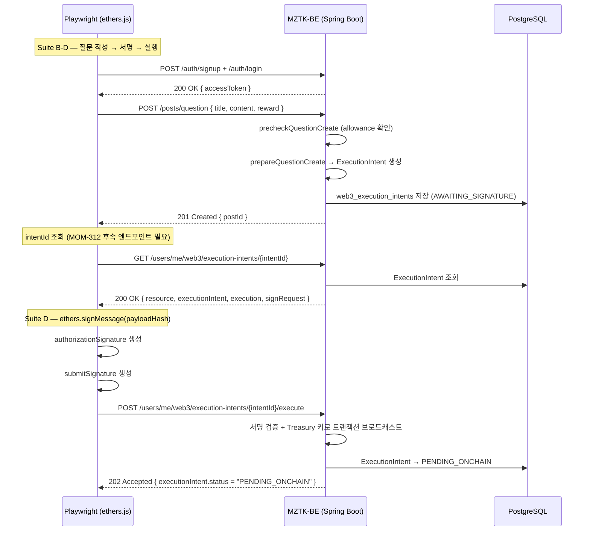

# QnA Escrow Playwright E2E 테스트

## 개요

`qna-escrow.spec.ts` 는 **EIP-7702 기반 QnA Escrow 플로우**를
Playwright + ethers.js 를 사용해 HTTP 레이어에서 검증하는 E2E 테스트입니다.

> 온체인 트랜잭션 확정은 워커 스케줄러가 처리하므로 이 스크립트에서는 다루지 않습니다.
> Suite A 는 서버 설정과 무관하게 즉시 실행 가능합니다.
> Suite B-D 는 QnA Escrow 컨트랙트 및 EIP-7702 인프라가 설정된 환경에서 실행해야 합니다.

---

## 테스트 대상 API

| 엔드포인트 | 메서드 | 설명 |
|---|---|---|
| `/posts/question` | POST | 질문 작성 → Execution Intent 생성 |
| `/questions/{postId}/answers` | POST | 답변 작성 → Execution Intent 생성 |
| `/users/me/web3/execution-intents/{id}` | GET | Intent 상태 · signRequest 조회 |
| `/users/me/web3/execution-intents/{id}/execute` | POST | 서명 제출 → PENDING_ONCHAIN 전이 |

---

## 사전 조건

### 1. 백엔드 서버 실행

```bash
./gradlew bootRun
```

서버가 `http://127.0.0.1:8080` 에서 응답하는지 확인합니다.

### 2. 백엔드 설정 (Suite B-D 필수)

| 변수/설정 | 설명 |
|---|---|
| `web3.reward-token.enabled=true` | QnA Escrow 기능 활성화 |
| `web3.eip7702.enabled=true` | EIP-7702 실행 기능 활성화 |
| `web3.qna-escrow.qna-contract-address` | QnA Escrow 컨트랙트 주소 |
| `web3.reward-token.token-contract-address` | MZTK 토큰 컨트랙트 주소 |
| `web3_treasury_keys` DB 레코드 | Treasury 키 (Suite D 필수) |

### 3. Playwright `.env` 설정

`play_wright/.env` 파일에 아래 값을 설정합니다.

```dotenv
BACKEND_URL=http://127.0.0.1:8080
WEB3_EIP712_DOMAIN_NAME=MomzzangSeven
WEB3_EIP712_DOMAIN_VERSION=1
WEB3_EIP712_CHAIN_ID=11155420
WEB3_EIP712_VERIFYING_CONTRACT=0x<컨트랙트 주소>
```

### 4. 토큰 승인(allowance) 설정 (Suite B-D 필수)

QnA 질문 작성 전 `precheckQuestionCreate` 가 테스트 지갑의 escrow 컨트랙트 allowance 를 확인합니다.
지갑에 충분한 allowance 가 설정되어 있어야 합니다.

---

## 테스트 실행

```bash
cd src/test/java/momzzangseven/mztkbe/integration/play_wright

# 의존성 설치 (최초 1회)
npm install

# Suite A 만 실행 (인프라 불필요)
npx playwright test qna-escrow.spec.ts --grep "Suite A"

# 전체 테스트 실행 (인프라 필요)
npx playwright test qna-escrow.spec.ts

# 상세 출력
npx playwright test qna-escrow.spec.ts --reporter=line

# HTML 리포트
npx playwright show-report
```

---

## 테스트 케이스 목록

### Suite A — 사전 조건 오류 (인프라 불필요)

| TC ID | 테스트명 | 예상 HTTP 상태 |
|---|---|---|
| TC-QNA-A-01 | 인증 없이 execution intent 조회 | `401` |
| TC-QNA-A-02 | 인증 없이 execution intent 실행 | `401` |
| TC-QNA-A-03 | 인증 없이 질문 작성 | `401` |

### Suite B — 질문 작성 후 Execution Intent 생성

| TC ID | 테스트명 | 예상 HTTP 상태 | 비고 |
|---|---|---|---|
| TC-QNA-B-01 | 질문 작성 → 201 Created + postId 반환 | `201` | `@requires-escrow-infra` |

### Suite C — Execution Intent 조회 및 응답 구조 검증

| TC ID | 테스트명 | 예상 HTTP 상태 | 비고 |
|---|---|---|---|
| TC-QNA-C-01 | 질문 작성 후 intent 조회 → AWAITING_SIGNATURE | `200` | `@requires-escrow-infra` / intentId 노출 엔드포인트 추가 후 활성화 |
| TC-QNA-C-02 | 존재하지 않는 intent ID 조회 → 4xx | `4xx` | |

### Suite D — EIP-7702 서명 제출 → PENDING_ONCHAIN 전이

| TC ID | 테스트명 | 예상 HTTP 상태 | 비고 |
|---|---|---|---|
| TC-QNA-D-01 | 서명 제출 → PENDING_ONCHAIN 전이 | `202` | `@requires-treasury-key` / intentId 노출 후 활성화 |

---

## EIP-7702 서명 구조

QnA Escrow 실행 시 2개의 서명이 필요합니다.

### 1. Authorization 서명 (EIP-7702 위임 인가)

```
signRequest.authorization.payloadHashToSign  ← 백엔드가 계산한 authorization 해시
서명 방법: eth_sign(privKey, payloadHashToSign)
```

### 2. Submit 서명 (실행 트랜잭션 인가)

```
signRequest.submit.executionDigest  ← 백엔드가 EIP-712 로 계산한 실행 다이제스트
서명 방법: eth_sign(privKey, executionDigest)
```

---

## 플로우 다이어그램



---

## 현재 제약 및 후속 과제

### intentId 노출 엔드포인트 부재 (TC-QNA-C-01, D-01 미활성화 원인)

현재 `POST /posts/question` 응답에는 생성된 `executionIntentId` 가 포함되지 않습니다.
클라이언트가 intent ID 를 알기 위해 아래 중 하나가 필요합니다.

1. `POST /posts/question` 응답에 `executionIntentId` 필드 추가 (권장)
2. `GET /users/me/web3/execution-intents?resourceId=web3:QUESTION:{postId}` 형태의 조회 엔드포인트 추가

이 작업은 MOM-312 후속 티켓으로 진행 예정입니다.

---

## 테스트 결과

> 실행 일시: **미실행 (Suite B-D 인프라 대기)**
> Suite A 단독 실행 결과:

### Suite A — 사전 조건 오류

| # | TC ID | 테스트명 | 결과 | 소요 시간 |
|---|---|---|---|---|
| 1 | TC-QNA-A-01 | 인증 없이 execution intent 조회 → 401 | ✅ passed | - |
| 2 | TC-QNA-A-02 | 인증 없이 execution intent 실행 → 401 | ✅ passed | - |
| 3 | TC-QNA-A-03 | 인증 없이 질문 작성 → 401 | ✅ passed | - |

> Suite B-D 는 QnA Escrow 인프라(컨트랙트 배포 + treasury key 설정 + allowance) 설정 후 업데이트 예정입니다.
