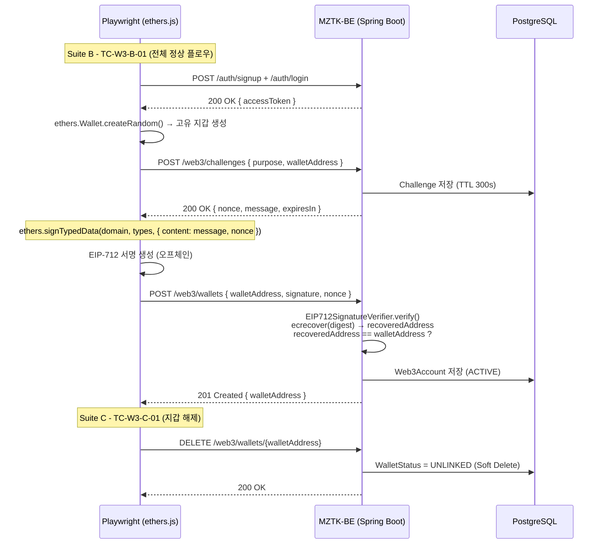

# Web3 지갑 연동 Playwright E2E 테스트

## 개요

`web3-wallet.spec.ts` 는 **Optimism Sepolia Testnet** 기반의 지갑 연동 플로우를  
Playwright + ethers.js 를 사용해 HTTP 레이어에서 검증하는 E2E 테스트입니다.

> 실제 온체인 트랜잭션(토큰 전송 등)은 발생하지 않습니다.  
> 지갑 등록 시 EIP-712 서명 검증만 수행하며, 서명 생성은 `ethers.js` 를 통해 로컬에서 처리합니다.  
> 각 테스트는 `ethers.Wallet.createRandom()` 으로 고유 지갑을 동적 생성하므로  
> `.env` 에 `TEST_WALLET_*` 변수를 별도로 설정할 필요가 없습니다.

---

## 테스트 대상 API

| 엔드포인트 | 메서드 | 설명 |
|---|---|---|
| `/web3/challenges` | POST | EIP-4361 챌린지 메시지 발급 |
| `/web3/wallets` | POST | EIP-712 서명 검증 후 지갑 등록 |
| `/web3/wallets/{walletAddress}` | DELETE | 지갑 해제 (Soft Delete) |

---

## 사전 조건

### 1. 백엔드 서버 실행

```bash
# 프로젝트 루트에서 Spring Boot 실행
./gradlew bootRun
```

서버가 `http://127.0.0.1:8080` 에서 응답하는지 확인합니다.

### 2. 백엔드 `.env` 확인

백엔드 루트의 `.env` 파일에 아래 값이 올바르게 설정되어 있어야 합니다.

| 변수명 | 설명 |
|---|---|
| `WEB3_CHAIN_ID` | `11155420` (Optimism Sepolia) |
| `WEB3_EIP712_VERIFYING_CONTRACT` | MZTK 토큰 컨트랙트 주소 |

### 3. Playwright `.env` 설정

`play_wright/.env.example` 을 복사하여 `.env` 를 생성합니다.  
`TEST_WALLET_*` 지갑 키는 **더 이상 필요하지 않습니다.** `BACKEND_URL` 만 필요합니다.

```dotenv
BACKEND_URL=http://127.0.0.1:8080
```

> **지갑 주소 자동 생성**: 이전 버전에서는 고정 지갑 키를 `.env` 에 등록해야 했으나,  
> 현재는 `ethers.Wallet.createRandom()` 으로 테스트마다 고유 지갑을 생성합니다.  
> 덕분에 이전 실행의 DB 상태와 무관하게 항상 동일하게 동작합니다(멱등성 보장).

---

## EIP-712 서명 구조

백엔드 `EIP712SignatureVerifier` 와 테스트의 `signEip712()` 헬퍼가 동일한 도메인/타입을 사용합니다.

```json
{
  "types": {
    "EIP712Domain": [
      {"name": "name",              "type": "string"},
      {"name": "version",           "type": "string"},
      {"name": "chainId",           "type": "uint256"},
      {"name": "verifyingContract", "type": "address"}
    ],
    "AuthRequest": [
      {"name": "content", "type": "string"},
      {"name": "nonce",   "type": "string"}
    ]
  },
  "primaryType": "AuthRequest",
  "domain": {
    "name":              "MomzzangSeven",
    "version":           "1",
    "chainId":           11155420,
    "verifyingContract": "0x815B53fD2D56044BaC39c1f7a9C7d3E67322f0F5"
  },
  "message": {
    "content": "<EIP-4361 챌린지 메시지 전체>",
    "nonce":   "<challenge.nonce>"
  }
}
```

---

## 테스트 실행

```bash
cd src/test/java/momzzangseven/mztkbe/integration/play_wright

# 의존성 설치 (최초 1회)
npm install

# 전체 테스트 실행
npx playwright test web3-wallet.spec.ts

# 상세 출력
npx playwright test web3-wallet.spec.ts --reporter=line

# 결과 HTML 리포트 열기
npx playwright show-report
```

---

## 테스트 케이스 목록

### Suite A — Challenge 발급 API

| TC ID | 테스트명 | 예상 HTTP 상태 |
|---|---|---|
| TC-W3-A-01 | 유효한 지갑 주소로 챌린지 발급 | `200` |
| TC-W3-A-02 | 인증 없이 챌린지 요청 | `401` |
| TC-W3-A-03 | purpose 필드 누락 | `400` |
| TC-W3-A-04 | 존재하지 않는 purpose 값 | `400` |

### Suite B — Wallet 등록 API (EIP-712 서명 검증)

| TC ID | 테스트명 | 예상 HTTP 상태 |
|---|---|---|
| TC-W3-B-01 | 챌린지 발급 → EIP-712 서명 → 지갑 등록 성공 | `201` |
| TC-W3-B-02 | 잘못된 서명 포맷으로 지갑 등록 | `400` |
| TC-W3-B-03 | 다른 개인키로 생성한 서명 (서명 불일치) | `400` 또는 `401` |
| TC-W3-B-04 | 인증 없이 지갑 등록 요청 | `401` |

### Suite C — Wallet 해제 API

| TC ID | 테스트명 | 예상 HTTP 상태 |
|---|---|---|
| TC-W3-C-01 | 등록된 지갑 해제 성공 | `200` |
| TC-W3-C-02 | 등록되지 않은 지갑 해제 | `400` 또는 `404` |
| TC-W3-C-03 | 인증 없이 지갑 해제 | `401` |
| TC-W3-C-04 | 지갑 해제 후 동일 지갑 재등록 가능 | `201` |

---

## 플로우 다이어그램



---

## 테스트 결과

> 실행 일시: **2026-03-05 (UTC+9 기준 2026-03-06 00:21)**  
> Playwright 버전: **1.58.2**  
> 실행 환경: chromium (1 worker)  
> 총 실행 시간: **2,568ms**

### 최종 결과 요약

| 항목 | 값 |
|---|---|
| 전체 케이스 | 12 |
| 통과 (passed) | **12** |
| 실패 (failed) | 0 |
| 스킵 (skipped) | 0 |

### Suite A — Challenge 발급 API

| # | TC ID | 테스트명 | 결과 | 소요 시간 |
|---|---|---|---|---|
| 1 | TC-W3-A-01 | 유효한 지갑 주소로 챌린지 발급 → 200 OK + EIP-4361 메시지 반환 | ✅ passed | 270ms |
| 2 | TC-W3-A-02 | 인증 없이 챌린지 요청 → 401 Unauthorized | ✅ passed | 11ms |
| 3 | TC-W3-A-03 | purpose 필드 누락 → 400 Bad Request | ✅ passed | 192ms |
| 4 | TC-W3-A-04 | 존재하지 않는 purpose 값 → 400 Bad Request | ✅ passed | 181ms |

**TC-W3-A-01 상세 출력**
```
✓ nonce       = 794aa7e2-6c0b-48c6-8154-ecd874cd7f67
✓ expiresIn   = 300s
✓ message(첫줄) = MZTK wants you to register your wallet with your Ethereum account:
```

### Suite B — Wallet 등록 API (EIP-712 서명 검증)

| # | TC ID | 테스트명 | 결과 | 소요 시간 |
|---|---|---|---|---|
| 5 | TC-W3-B-01 | 챌린지 발급 → EIP-712 서명 → 지갑 등록 성공 → 201 Created | ✅ passed | 183ms |
| 6 | TC-W3-B-02 | 잘못된 서명 포맷으로 지갑 등록 → 400 Bad Request | ✅ passed | 186ms |
| 7 | TC-W3-B-03 | 다른 개인키로 생성한 서명 → 서명 검증 실패 → 400 Bad Request | ✅ passed | 202ms |
| 8 | TC-W3-B-04 | 인증 없이 지갑 등록 요청 → 401 Unauthorized | ✅ passed | 10ms |

**TC-W3-B-01 상세 출력**
```
✓ 지갑 등록 성공: address=0xa14f6535b3b87eddf30aef5b448e25431b8d10a3
```

### Suite C — Wallet 해제 API

| # | TC ID | 테스트명 | 결과 | 소요 시간 |
|---|---|---|---|---|
| 9 | TC-W3-C-01 | 등록된 지갑 해제 성공 → 200 OK | ✅ passed | 208ms |
| 10 | TC-W3-C-02 | 등록되지 않은 지갑 해제 → 404 또는 400 | ✅ passed | 178ms |
| 11 | TC-W3-C-03 | 인증 없이 지갑 해제 → 401 Unauthorized | ✅ passed | 5ms |
| 12 | TC-W3-C-04 | 지갑 해제 후 동일 지갑 재등록 가능 | ✅ passed | 217ms |

**TC-W3-C-01~C-04 상세 출력**
```
✓ 지갑 해제 성공: address=0x571f14BbEb810c349722ff5Be05178dbd13076f4
✓ 미등록 지갑 해제 시도 → 404
✓ 인증 없는 해제 요청 → 401 Unauthorized
✓ 해제 후 재등록 성공: address=0x6f081f847fFaCd9bF57Fa853f9F016fd572bCA40
```

---

## 주의 사항

1. **테스트 격리 보장**: 각 테스트는 `ethers.Wallet.createRandom()` 으로 고유한 지갑을 생성합니다. 이전 실행에서 DB에 ACTIVE 상태로 남은 지갑과 충돌하지 않으므로 몇 번을 반복 실행해도 항상 동일한 결과를 보장합니다.
2. **EIP-712 도메인 일치**: 백엔드의 `application.yml` 에서 `web3.eip712` 설정이 변경되면 `web3-wallet.spec.ts` 상단의 `EIP712_DOMAIN` 상수도 함께 업데이트해야 합니다.
3. **Token Transfer 테스트**: `POST /users/me/token-transfers/prepare` 및 `submit` 은 Level-Up 이력과 Treasury 지갑 잔액이 필요하므로 이 스크립트에서는 다루지 않습니다. 별도 E2E 시나리오가 필요할 경우 `web3-token-transfer.spec.ts` 를 추가하세요.
